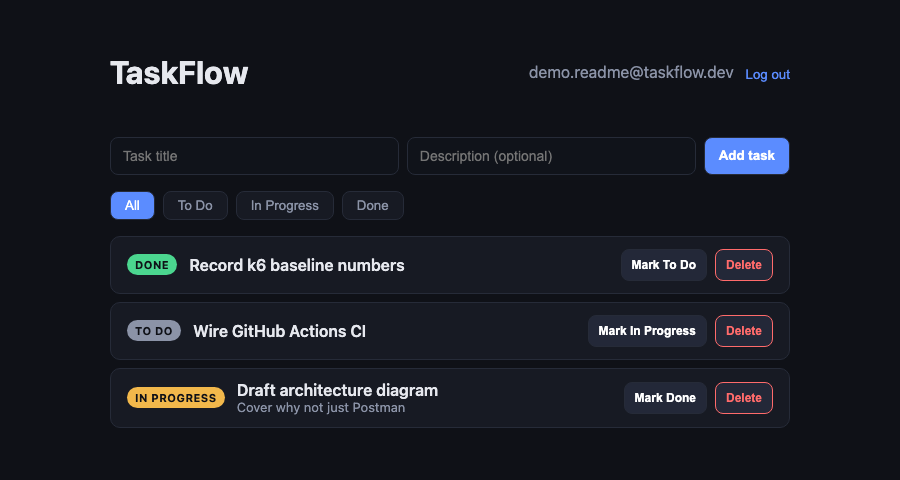
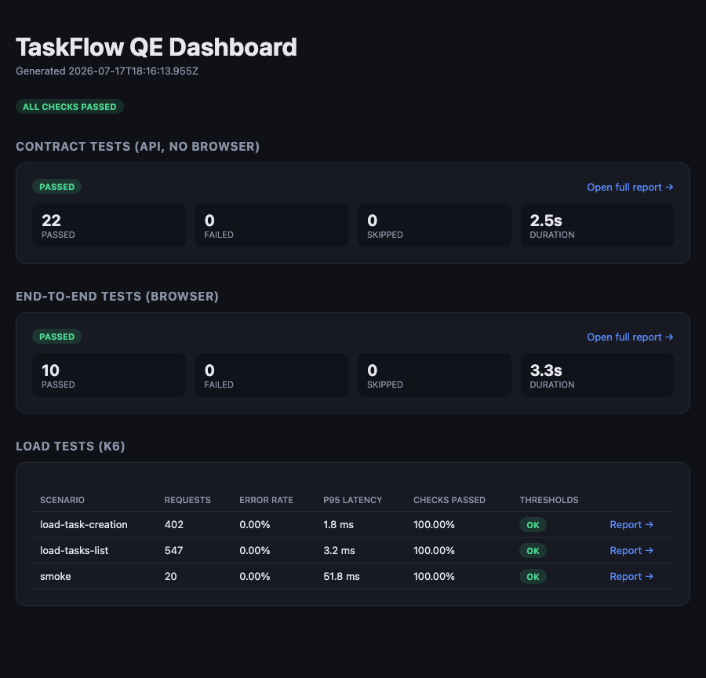

# TaskFlow QE — E2E + Contract + Load Testing Framework

A quality-engineering framework built around a small full-stack task tracker:
**Playwright (TypeScript) for browser E2E**, **OpenAPI-validated API contract
tests**, and **k6 load tests**, all wired into a **GitHub Actions** pipeline
that publishes a static **results dashboard** on every run to `main`.

The app under test (TaskFlow) is intentionally minimal — auth, CRUD, filtering,
pagination — so the framework itself is the point: three test layers that
answer three different questions, running in a pipeline that produces
evidence, not just a green checkmark.

---

## Table of Contents

1. [Problem Statement](#problem-statement)
2. [Architecture](#architecture)
3. [Quick Start](#quick-start)
4. [Project Structure](#project-structure)
5. [The Three Test Layers](#the-three-test-layers)
6. [Design Decisions and Rationale](#design-decisions-and-rationale)
7. [CI Pipeline](#ci-pipeline)
8. [Results](#results)

---

## Problem Statement

Most test suites answer one question — "does the UI work?" — and stop there.
That leaves two gaps:

1. **The k6 / load-testing gap.** UI tests tell you nothing about how the
   backend behaves under concurrent traffic. A feature can pass every E2E
   test and still fall over the first time real usage hits it.
2. **The CI/CD evidence gap.** Even teams with good test suites often can't
   answer "show me the last run" without digging through raw CI logs. There's
   no artifact a reviewer, manager, or interviewer can open and read in ten
   seconds.

TaskFlow QE closes both at once: it adds a load-testing layer alongside the
functional layers, and it turns every CI run into a published, browsable
dashboard — so "does it work" and "does it hold up" are both one click away.

---

## Architecture

```
┌─────────────────────────────────────────────────────────────────────┐
│                         SYSTEM UNDER TEST                           │
│                                                                     │
│   ┌───────────────────────┐        ┌───────────────────────────┐  │
│   │   React + TS (5173)   │  HTTP  │   Express + TS API (4000)  │  │
│   │   Login / Task board  │───────▶│   /api/auth, /api/tasks    │  │
│   └───────────────────────┘        │   In-memory store           │  │
│                                     └───────────────────────────┘  │
└─────────────────────────────────────────────────────────────────────┘
                    ▲                          ▲
                    │ drives browser           │ direct HTTP
                    │                          │
┌───────────────────┴──────────┐   ┌───────────┴───────────────────┐
│   Playwright E2E (browser)   │   │  Playwright contract (API)     │
│   tests/e2e/specs/*.spec.ts  │   │  tests/contract/specs/*.spec.ts│
│   Page Object Model           │   │  Validates every response      │
│   "does the feature work     │   │  against openapi.yaml via AJV  │
│    for a user?"               │   │  "does the API honor its       │
└───────────────────────────────┘   │   contract?"                   │
                    │               └────────────┬────────────────┘
                    │                             │
                    │               ┌─────────────┴────────────────┐
                    │               │        k6 load tests          │
                    │               │  tests/load/k6/*.js            │
                    │               │  ramping-vus / arrival-rate    │
                    │               │  "does it survive real load?"  │
                    │               └────────────┬────────────────┘
                    │                             │
                    ▼                             ▼
┌─────────────────────────────────────────────────────────────────────┐
│                      GitHub Actions (.github/workflows/ci.yml)      │
│                                                                     │
│   e2e-tests ──┐                                                     │
│   contract-tests ─┴──▶ load-tests ──▶ dashboard (build-dashboard.js)│
│                                              │                      │
│                                              ▼                      │
│                                     gh-pages (static HTML site)     │
└─────────────────────────────────────────────────────────────────────┘
```

| Layer | Tool | Talks to | Answers |
|---|---|---|---|
| E2E | Playwright (`page`) | Real browser → UI → API | "Does the feature work for a user?" |
| Contract | Playwright (`request`) | API directly, no browser | "Does the API honor its documented shape?" |
| Load | k6 | API directly, many VUs | "Does the API survive real concurrent traffic?" |
| Evidence | GitHub Actions + static dashboard | All three reports | "Show me the last run." |

---

## Quick Start

Requires Node 18+.

```bash
git clone <this-repo>
cd taskflow-qe

# 1. Install and run the app
(cd app/backend && npm install && npm run dev)     # :4000
(cd app/frontend && npm install && npm run dev)    # :5173

# 2. Install test tooling
cd tests
npm install
npx playwright install chromium

# 3. Run each layer
npm run test:api     # 22 contract tests, ~2s, no browser needed
npm run test:e2e     # 10 E2E tests, ~3s, starts backend+frontend for you
cd ../tests/load/k6
k6 run smoke.js
k6 run load-tasks-list.js
k6 run load-task-creation.js
```

`npm run test:e2e` and `npm run test:api` each declare their own
`webServer` in `playwright.config.ts` / `playwright.api.config.ts`, so they
boot (or reuse) the app themselves — no manual server juggling required
once dependencies are installed.

Build the dashboard from whatever results are on disk:

```bash
cd taskflow-qe
node .github/scripts/build-dashboard.js
open dashboard/dist/index.html
```

---

## Project Structure

```
taskflow-qe/
├── app/
│   ├── backend/            Express + TS API (auth, tasks CRUD, in-memory store)
│   │   └── openapi.yaml    The contract — hand-authored, tests validate against it
│   └── frontend/           React + TS task board (Vite)
│
├── tests/
│   ├── e2e/                 Browser E2E (Page Object Model)
│   │   ├── pages/           LoginPage.ts, TasksPage.ts
│   │   ├── fixtures/        seededUser fixture, localStorage session injection
│   │   ├── helpers/         API seeding helpers
│   │   └── specs/           auth.spec.ts, tasks.spec.ts
│   ├── contract/            API contract tests (no browser)
│   │   ├── schema.ts        Loads openapi.yaml, compiles AJV validators
│   │   └── specs/           health, auth, tasks
│   ├── load/k6/              k6 scripts + shared config/report helpers
│   ├── playwright.config.ts       E2E: starts backend + frontend
│   └── playwright.api.config.ts   Contract: starts backend only
│
├── .github/
│   ├── workflows/ci.yml     4 jobs: e2e-tests, contract-tests, load-tests, dashboard
│   └── scripts/build-dashboard.js   Combines all 3 reports into one static site
│
└── docs/                    README screenshots
```

---

## The Three Test Layers

### 1. E2E (`tests/e2e`)

Drives a real Chromium browser against the running frontend, which talks to
the running backend over real HTTP. Page Object Model (`LoginPage.ts`,
`TasksPage.ts`) keeps selectors out of the spec files — if a `data-testid`
changes, one file is updated instead of every test that touches it.

Each test gets a **freshly registered user** via the API (`seededUser`
fixture), then injects the resulting session token into `localStorage`
before navigating — the UI is only driven for the behavior actually under
test (e.g. the login form itself), not re-run as setup for every other test.
Because tasks are scoped by `userId` server-side, tests never interfere with
each other even running in parallel, with no database reset between them.

### 2. API contract (`tests/contract`)

Same `APIRequestContext` mechanism Playwright uses for E2E seeding, promoted
to be the thing under test. No browser, no JS execution — just HTTP in, JSON
out. The distinguishing feature: every response is validated with
**`assertMatchesSchema(name, body)`**, which checks the live response
against the matching schema in `openapi.yaml` using AJV. That's a stronger
guarantee than hand-picking a few fields to assert on — a field silently
renamed or dropped fails the test even if no one remembered to add an
assertion for it.

22 tests cover the full status-code matrix: 200/201/204 happy paths,
400 validation errors (empty title, bad email, weak password, invalid
status/enum), 401 (missing/garbage token), 404 (missing task, cross-user
access), 409 (duplicate email), plus pagination and filter-by-status
behavior.

### 3. Load (`tests/load/k6`)

| Script | Models | Executor |
|---|---|---|
| `smoke.js` | Sanity pass before trusting real load numbers | 1 VU, 5 iterations |
| `load-tasks-list.js` | Many users with a task board open, polling `GET /api/tasks` | `ramping-vus`: 0→10→25→0 over 40s |
| `load-task-creation.js` | A burst of writes (backlog import, several users adding tasks) | `constant-arrival-rate`: 20 req/s for 20s |

Every script shares `config.js` (`http_req_failed` rate < 1%, `p(95)` < 500ms)
and `report.js` (`handleSummary()` → terminal summary + JSON + standalone
HTML report via k6-reporter). k6 exits non-zero on a threshold breach, which
is what fails the `load-tests` CI job.

---

## Design Decisions and Rationale

**Why three separate test layers instead of one big Playwright suite?**
> They fail for different reasons and run at different costs. A UI test failure
> could mean the API broke, the JS broke, a CSS selector moved, or the network
> hiccuped — it doesn't tell you where to look. A contract test failure means
> exactly one thing: the API stopped honoring its documented shape. Layering
> them means a broken build points you at the right layer immediately, and
> the fast layer (contract, ~2s) can gate the slow one (load tests) in CI
> before burning time on load generation against a backend already known to
> be broken.

**Why validate against `openapi.yaml` with AJV instead of asserting on a few fields per test?**
> Field-by-field assertions only catch what the test author thought to check.
> Schema validation catches everything the schema declares — an extra field
> becomes forbidden implicitly under `additionalProperties` conventions, and
> a missing required field or wrong type fails immediately. It also means the
> OpenAPI spec is a live contract instead of documentation that quietly goes
> stale: if the API and the spec disagree, a test fails, not a changelog.

**Why Playwright's `request` fixture for contract tests instead of Postman/Newman or Dredd?**
> Consistency and reuse. The same `APIRequestContext` mechanism already seeds
> data for the E2E suite (`helpers/api.ts`), so contract tests reuse it as
> the test subject instead of learning a second HTTP client and a second
> assertion syntax. It's also just TypeScript — the same language, tooling,
> and CI runner as everything else in the repo, so there's no separate
> Postman collection to keep in sync by hand.

**Why k6 over JMeter or Locust?**
> Scripts are JavaScript, not XML or a separate DSL — the same team that
> writes the Playwright tests can read and modify the load tests. k6's
> `options.scenarios` model (`ramping-vus`, `constant-arrival-rate`) maps
> directly onto real traffic shapes ("gradual ramp" vs. "fixed throughput
> burst") instead of abstracting them behind thread-group config. Threshold
> failures are a first-class exit code, which is what makes `k6 run` a
> meaningful CI gate rather than just a number to eyeball.

**Why an in-memory data store instead of Postgres/SQLite for the demo API?**
> This app exists to be tested, not to demonstrate a persistence layer. An
> in-memory `Map` means zero native bindings, zero container startup, and a
> `/api/test/reset` endpoint that's a one-line `Map.clear()` — which keeps
> CI fast and removes an entire class of "the DB container wasn't ready yet"
> flakiness. The trade-off (no real persistence, no concurrent-write edge
> cases) is explicitly fine here: those are things the framework isn't
> trying to prove.

**Why per-test user registration instead of a shared fixture user + DB reset?**
> Tasks are scoped by `userId` in every query, so two tests can run fully in
> parallel without ever seeing each other's data — no reset needed between
> tests, no `test.describe.serial()`, no risk of one test's leftover task
> polluting another test's count assertion. `global-setup.ts` still calls
> `/api/test/reset` once per full run, purely to clear state left over from
> a previous local run — not for inter-test isolation.

**Why two separate Playwright configs (`playwright.config.ts` vs. `playwright.api.config.ts`) instead of one?**
> They have different `webServer` requirements. E2E needs both the backend
> and the frontend running; contract tests only ever talk to the backend.
> Splitting the config means the `contract-tests` CI job never installs a
> browser or builds the frontend — it's the fastest job in the pipeline by
> a wide margin, which matters because `load-tests` is gated on it passing
> first.

**Why a static HTML dashboard on GitHub Pages instead of a hosted reporting service (Allure TestOps, Currents, etc.)?**
> Zero external accounts, zero secrets to manage beyond the token GitHub
> Actions already provides, and it's inspectable by anyone with the repo URL
> — no login wall between a reviewer and the evidence. `build-dashboard.js`
> is plain Node with no dependencies, reading the same JSON artifacts
> (`api-results.json`, `e2e-results.json`, k6's `handleSummary()` output)
> that a paid tool would ingest, so swapping in a hosted service later is a
> one-file change, not a rearchitecture.

**Why does the `dashboard` job run even if earlier jobs fail (`if: always()`)?**
> A red build is exactly when you most want the dashboard to update — "the
> pipeline is broken and here's the report showing why" is more useful than
> a dashboard that silently stops updating and leaves the last green run
> looking current.

---

## CI Pipeline

`.github/workflows/ci.yml` — four jobs on every push/PR to `main`:

1. **`contract-tests`** — installs only the backend + test deps (no browser,
   no frontend), runs `npm run test:api`, uploads the Playwright HTML report.
2. **`e2e-tests`** — installs backend + frontend + test deps + Chromium,
   runs `npm run test:e2e`, uploads its HTML report.
3. **`load-tests`** — `needs: contract-tests`, so load is never generated
   against a backend already known to be broken. Starts the backend, runs
   all three k6 scripts via `grafana/setup-k6-action`, uploads the JSON/HTML
   results.
4. **`dashboard`** — `needs: [e2e-tests, contract-tests, load-tests]`,
   `if: always()` and only on `main`. Downloads all three artifacts, runs
   `build-dashboard.js`, publishes `dashboard/dist/` to `gh-pages` via
   `peaceiris/actions-gh-pages`.

To view the published dashboard: enable **Settings → Pages → source:
`gh-pages` branch**, then visit `https://<you>.github.io/<repo>/` after the
first successful run on `main`.

---

## Results

**The app under test** — TaskFlow, seeded via the same API helpers the tests use:



**The dashboard** produced by `build-dashboard.js` from a real local run —
22/22 contract tests, 10/10 E2E tests, and all three k6 scenarios inside
their thresholds (0% error rate, p95 well under the 500ms budget):



Local run summary at the time of writing:

| Suite | Result |
|---|---|
| Contract tests | 22 passed, 0 failed (~2.5s) |
| E2E tests | 10 passed, 0 failed (~3.3s) |
| `smoke.js` | 20 requests, 0% failed, p95 51.8ms |
| `load-tasks-list.js` | 547 requests @ up to 25 VUs, 0% failed, p95 3.2ms |
| `load-task-creation.js` | 402 requests @ 20 req/s, 0% failed, p95 1.8ms |
